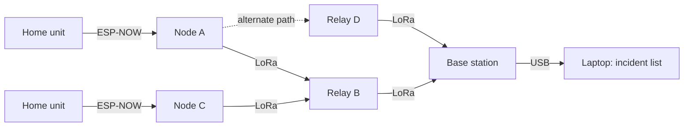
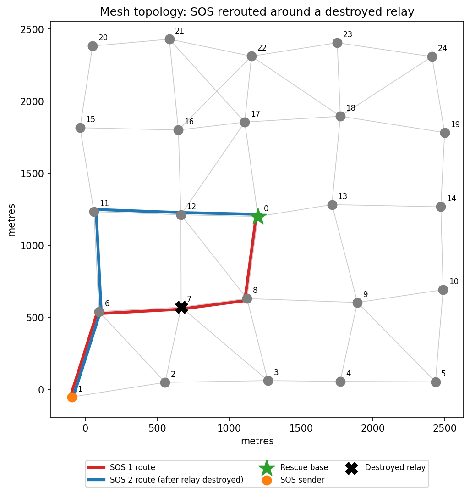
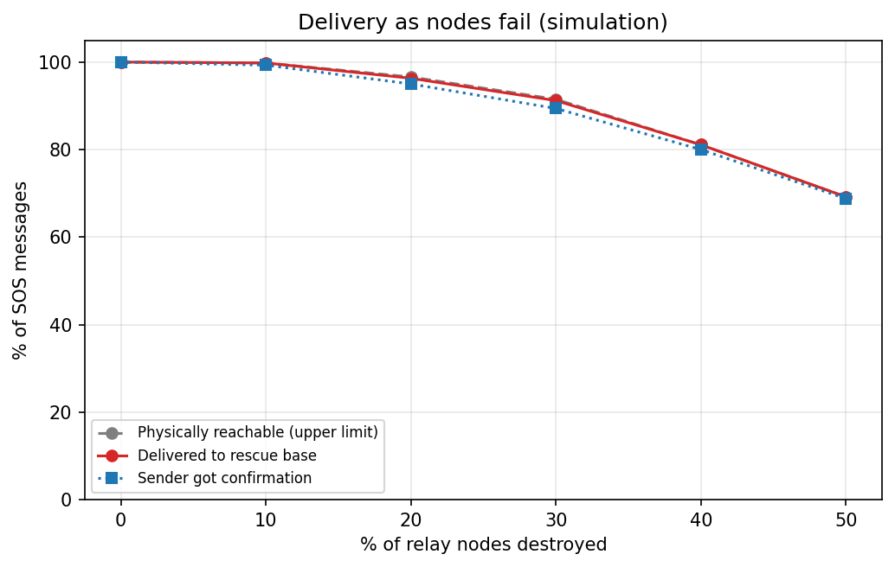
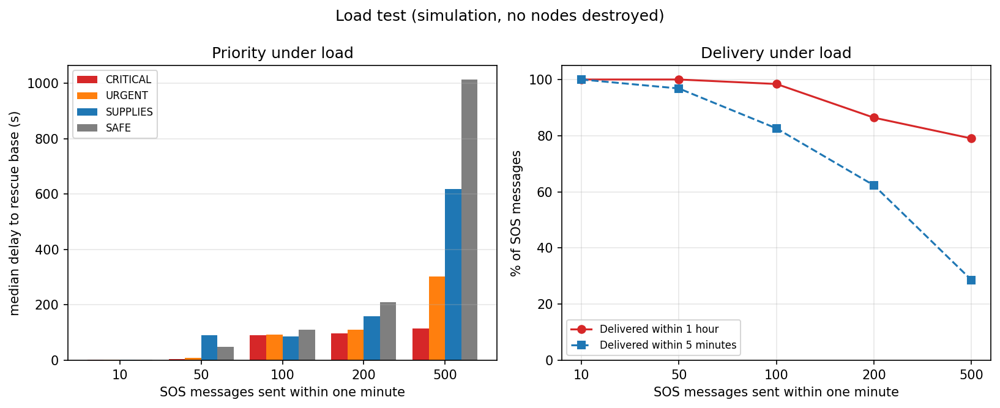

# Emergency Communication Network (ESP32 + LoRa Mesh)

> Low-cost ESP32 radio nodes that let people send an SOS to a rescue base when the mobile towers and the internet are down. You press a button on your home unit, it goes over ESP-NOW to the nearest relay, then relay to relay over LoRa to the base, and the confirmation shows on the home unit's screen. No phone, app, SIM card or signal needed.

Made by Manit Bhasin, Divit Rastogi and Rajveer Kapoor (LVISG) for the SHISTECH SDG track.

**Live demo:** https://manit-bhasin.github.io/Shistech_Lvis/emergency-mesh/web_demo/

**Documents:** [Project brief](docs/project-brief.md) · [How the SOS demo works](docs/sos-demo-explained.md) · [Technical reference (PDF)](docs/technical-reference.pdf)

## Where to find each judging criterion

| Criterion | Points | Where to look |
|---|---|---|
| Innovation & Impact | 20 | Section 1 (the problem, from real Indian disasters), Section 2 (what is new), Section 12 (SDGs) |
| Technical Execution | 20 | Section 3 (simulator, results and 16 automated tests), Section 5 (protocol), the interactive demo, the [technical reference PDF](docs/technical-reference.pdf) |
| Design & Presentation | 20 | Section 2 (the home unit, built for someone in a hurry), Section 7 (home unit), the interactive demo |
| Problem-Solving & Thinking Skills | 15 | Section 8 (challenges and how we solved them), Section 3.5 (testing our own assumptions) |
| Documentation & Completeness | 10 | Section 6 (schematics), Section 11 (how to run everything), [`emergency-mesh/simulation/results/`](emergency-mesh/simulation/results) |

---

## Project status

| Part | Status | Where |
|---|---|---|
| Mesh logic: message IDs, duplicate dropping, hop limits, priority queue, random delays, listen-before-talk, delivery confirmations, retries, rate limits, heartbeats | **Built and tested** in a Python network simulator (16 automated tests) | [`emergency-mesh/simulation/`](emergency-mesh/simulation) |
| Disaster scenarios: rerouting, node failures, mass SOS, dead-node detection, sensitivity to radio assumptions | **Built**, results in Section 3 | [`emergency-mesh/simulation/results/`](emergency-mesh/simulation/results) |
| Packet format (max 31 bytes) and LoRa time-on-air | **Built** | [`protocol.py`](emergency-mesh/simulation/meshsim/protocol.py) |
| Node interface: OLED screen, SOS button, status LED | **Built** in the Wokwi ESP32 simulator (MicroPython) | [`emergency-mesh/wokwi_node/`](emergency-mesh/wokwi_node), [live project](https://wokwi.com/projects/476841677745845249) |
| Interactive map demo: click anywhere to send an SOS, destroy or repair nodes, simulate a crowd | **Built**, runs in any web browser | [`emergency-mesh/web_demo/`](emergency-mesh/web_demo) |
| Rescue dashboard | **Prototype**: priority-sorted incident table from the simulator (also saved as CSV) | `python run.py demo` |
| ESP32 firmware with LoRa radio | **Designed**, not built | Sections 5–6 |
| Home unit (ESP-NOW) | **Designed**, not built | Sections 6 and 7 |
| Schematics: system diagram, node block diagram, Wokwi circuit | **Included** | Sections 2 and 6 |
| Physical nodes | **Not done yet** | Section 10 |
| Field range tests for LoRa and ESP-NOW | **Not done yet** | Section 10 |

---

## Repository layout

```
.
├── docs/
│   ├── images/                   figures for the project brief (SVG)
│   ├── project-brief.md          what it is, how it works, results, how to present
│   └── sos-demo-explained.md     short guide to the demo
├── emergency-mesh/
│   ├── simulation/               Python network simulator; all results in Section 3
│   │   ├── run.py                command-line runner
│   │   ├── requirements.txt      matplotlib, only needed for charts
│   │   ├── meshsim/
│   │   │   ├── protocol.py       packet format, encoding, LoRa time-on-air
│   │   │   ├── node.py           node behaviour (rules planned for the firmware)
│   │   │   ├── network.py        event-driven radio simulator
│   │   │   ├── scenarios.py      demo, failures, load, health, sensitivity
│   │   │   └── visualize.py      charts
│   │   ├── tests/                16 automated tests (unittest)
│   │   └── results/              CSVs and charts from the last run
│   ├── web_demo/                 interactive map demo, published on GitHub Pages
│   │   ├── index.html            the page (double-click to open)
│   │   ├── style.css             styles, light and dark
│   │   ├── mesh.js               simulation engine (no DOM, so it also runs in Node)
│   │   ├── app.js                map drawing, controls, rescue dashboard
│   │   └── tests/mesh.test.js    19 engine tests (node --test)
│   └── wokwi_node/main.py        node interface prototype (MicroPython, Wokwi)
├── .gitignore                    Python caches and virtual environments
├── .nojekyll                     GitHub Pages serves files as they are
├── LICENSE                       MIT
└── README.md
```

---

## 1. The problem

When a cyclone, flood or landslide hits, mobile towers get damaged or lose power, and the people who need rescuing can't call anyone.

- **Cyclone Michaung, Chennai (December 2023).** On 5 December 2023, Tamil Nadu's Chief Secretary said 70% of Chennai's 42,747 cell towers were operational, so roughly 30% were still down ([Outlook India](https://www.outlookindia.com/amp/story/national/michaung-cyclone-live-chennai-india-news-tamil-nadu-cyclone-name-news-334622)). One resident told Business Standard she had no way to contact rescue teams without a network ([Business Standard](https://www.business-standard.com/india-news/cyclone-michaung-chennai-residents-battle-power-mobile-disruption-123120500994_1.html)).
- **Wayanad landslides (July 2024).** Telecom operators had to restore connectivity "on a war footing", and BSNL installed diesel engines so towers could keep working without grid power. ([Deccan Herald](https://www.deccanherald.com/india/keralam/telecom-operators-restore-augment-telecom-connectivity-in-landslide-hit-wayanad-3133367))
- **Satellite SOS is not available in India yet.** iPhone Emergency SOS via satellite and Pixel Satellite SOS are not available in India ([Apple](https://support.apple.com/en-in/101573) and [Google](https://support.google.com/pixelphone/answer/15254448) support pages).

In the first hours, before the towers come back, people need some way to tell a rescue team three things: where they are, what's wrong, and how many of them there are.

---

## 2. How the system works

1. Nodes are installed in advance at places people already gather: schools, relief camps, community halls, water tanks, high ground. Each has a battery and optional solar panel.
2. Each home has a small home unit. A person presses one of its buttons, and the SOS goes over ESP-NOW to the nearest relay node, with no phone, internet or app needed. Anyone outside can press the SOS button on a relay node.
3. Each of the four buttons is one priority: critical, urgent, supplies or "I'm safe".
4. The SOS hops from node to node over LoRa radio until it reaches the rescue base station.
5. The base lists incidents by priority and sends a confirmation back, and the home unit's screen changes to "Delivered to rescue base."
6. Every node sends a heartbeat every 15 minutes, so the base finds out about a dead node long before anyone needs it.



**The home unit.** It is designed but not built yet (the interactive demo shows the whole flow). The person using it may be scared, hurt or in the dark, so:
- There is no app, account, phone or internet involved. The unit is set up at install, including where it is.
- Four large priority buttons and nothing to type.
- Once the base confirms, the screen says "Delivered to rescue base".
- A physical SOS button on each relay node for anyone outside.
- A 16×2 LCD screen in English, with simple icons.

**How this differs from Meshtastic.** [Meshtastic](https://meshtastic.org/docs/introduction/) is open-source LoRa mesh messaging, and it inspired us. A phone is optional with it (its docs say "No phone required for mesh communication"). Ours does one job: a fixed-format priority SOS, a sorted incident list at the rescue base, heartbeats that flag dead relays, and cheap button home units.

---

## 3. Simulation results

The simulator places 25 nodes on a 5 × 5 grid, about 600 m apart (2.4 km × 2.4 km), with the rescue base at the centre. Every node runs the rules planned for the ESP32 firmware. Section 4 explains where every number comes from.

How the simulator works:
- Every send, wait and arrival is a timed event, so runs with tens of thousands of radio transmissions replay exactly from the same seed.
- Each packet's time on air comes from the LoRa formula in Semtech's SX1276 datasheet.
- Overlapping transmissions destroy each other at a receiver, a node can't receive while it is sending, and some packets are lost at random.
- Messages are encoded byte by byte in the format planned for the ESP32 (at most 31 bytes).
- 16 automated tests cover the packet format, airtime, forwarding, duplicate dropping, hop limit, rerouting, retries, priority order, rate limit, collisions, heartbeats and reachability.

All results below use random seed 7. We repeated the tests with seeds 3 and 11: exact numbers shift (most of all how many nodes stay reachable when many are destroyed, since that depends on which ones go), but the main conclusions held: the network delivered 99.7–100% of reachable messages, critical SOS stayed much faster than "I'm safe" messages under heavy load, and every dead node was detected.

### 3.1 Rerouting around a destroyed relay

A critical SOS travels `1 → 6 → 7 → 8 → base`. Relay 7 is then destroyed, and the next SOS from the same place automatically takes `1 → 6 → 11 → 12 → base`.



Rescue dashboard from the same run (sample Chennai coordinates):

| Priority | Type | Node | People | Flags | Landmark | Hops | Delay |
|---|---|---|---|---|---|---|---|
| CRITICAL | TRAPPED | 1 | 4 | INJURED, TRAPPED | School rooftop | 4 | 2.9 s |
| CRITICAL | MEDICAL | 11 | 7 | INJURED, TRAPPED | Water tank | 2 | 1.5 s |
| URGENT | FIRE | 16 | 1 | CHILD | Water tank | 2 | 0.8 s |
| URGENT | FLOODING | 17 | 8 | CHILD | Water tank | 1 | 1.1 s |
| URGENT | FLOODING | 1 | 6 | ELDERLY, WATER RISING | School rooftop | 4 | 1.9 s |
| SAFE | OTHER | 18 | 5 | – | Water tank | 2 | 6.5 s |

### 3.2 Delivery as nodes fail

Random relays are destroyed, then every surviving node sends one SOS within 30 seconds. 20 random networks per row.

| Relays destroyed | SOS sent | Physically reachable | Delivered | Delivered, of reachable | Sender confirmed | Median delay |
|---|---|---|---|---|---|---|
| 0% | 480 | 100% | 100% | 100% | 100% | 12.5 s |
| 10% | 440 | 99.8% | 99.8% | 100% | 99.3% | 8.7 s |
| 20% | 380 | 96.6% | 96.3% | 99.7% | 95.0% | 6.9 s |
| 30% | 340 | 91.5% | 91.2% | 99.7% | 89.4% | 4.7 s |
| 40% | 280 | 81.1% | 81.1% | 100% | 80.0% | 3.5 s |
| 50% | 240 | 69.2% | 69.2% | 100% | 68.8% | 2.5 s |



"Physically reachable" means a chain of surviving nodes (within 6 hops) still connects the sender to the base. The network delivered 99.7–100% of the messages that could still reach the base. Almost all losses came from nodes being cut off completely, which only more nodes can fix. The slowest 5% of messages took about 5 minutes, because their early attempts collided in the initial rush and had to be resent.

### 3.3 Many people sending SOS at once

N SOS messages from random nodes within one minute, no nodes destroyed. 5 random networks per row.

| SOS in 1 minute | Delivered within 1 hour | Within 5 minutes | Median delay: critical | urgent | supplies | "I'm safe" |
|---|---|---|---|---|---|---|
| 10 | 100% | 100% | 2.8 s | 2.4 s | 1.9 s | 1.5 s |
| 50 | 100% | 96.8% | 5.5 s | 8.8 s | 91.1 s | 49.4 s |
| 100 | 98.4% | 82.6% | 90.8 s | 92.7 s | 85.8 s | 110.4 s |
| 200 | 86.4% | 62.3% | 97.5 s | 110.5 s | 159.9 s | 209.4 s |
| 500 | 79.0% | 28.6% | 114.4 s | 302.2 s | 618.5 s | 1013.7 s |



- Priority holds up under heavy load: at 500 messages, critical SOS arrived in a median of about 2 minutes; "I'm safe" check-ins waited about 17.
- Collisions are the system's biggest weakness. Every message travels through every node, so a mass event causes heavy collisions: 40–50 collision events per SOS at 100+ messages. Delivery within an hour falls to 79% at 500 messages. Section 10 lists the planned fix.
- Indian rules limit each relay to transmitting 2.5% of the time. Our forwarding has every relay repeat every message, so a mass event (like the 500-SOS test) would exceed that. Normal use, mostly heartbeats, uses about 0.4% of each relay's time. (Our own calculation: a heartbeat is 16 bytes at SF9, about 0.165 s on air; 24 nodes × 4 heartbeats per hour, forwarded by each relay.)
- At light load there's no queue, so priority makes little difference.

### 3.4 Detecting dead nodes

Heartbeat every 15 minutes; alert after 30 minutes of silence. 10 runs, 3 nodes killed silently in each.

| Nodes killed | Detected | Missed | False alarms | Average time to alert | Longest |
|---|---|---|---|---|---|
| 30 | 30 | 0 | 0 | 20.8 min | 28.0 min |

### 3.5 What if our radio assumptions are wrong?

We re-ran the failure test (Section 3.2) with other values for radio range and random packet loss. 20 random networks per row.

| Range | Random loss | Destroyed | Reachable | Delivered | Delivered, of reachable |
|---|---|---|---|---|---|
| 500 m | 2% | 0% | 0% | 0% | n/a |
| 650 m | 2% | 0% | 82.7% | 82.3% | 99.5% |
| 650 m | 2% | 30% | 52.1% | 52.1% | 100% |
| **800 m** | **2%** | **0%** | **100%** | **100%** | **100%** |
| **800 m** | **2%** | **30%** | **91.5%** | **91.2%** | **99.7%** |
| 1000 m | 2% | 0% | 100% | 100% | 100% |
| 1000 m | 2% | 30% | 99.7% | 99.7% | 100% |
| 800 m | 0% | 30% | 91.5% | 91.5% | 100% |
| 800 m | 5% | 30% | 91.5% | 91.5% | 100% |
| 800 m | 10% | 30% | 91.5% | 91.2% | 99.7% |

- Random packet loss of 0–10% barely changes anything, because retries and multiple paths cover lost packets.
- Range matters a lot. At 500 m, nodes 600 m apart can't hear each other at all. The protocol still delivered 99.5–100% of reachable messages in every case, but nodes have to be placed closer together than their real range. In a real deployment, spacing comes from range measured on site.

Full table, including 0% destroyed for every setting: `emergency-mesh/simulation/results/sensitivity.csv`.

---

## 4. Where the numbers come from

**Radio settings (from published sources):**

| Value | Reason |
|---|---|
| 865–868 MHz band | Licence-exempt in India under the Use of Low Power Equipment in the Frequency Band 865–868 MHz for Short Range Devices (Exemption from Licence) Rules, 2021 (G.S.R. 853(E)). For tracking, tracing and data acquisition devices: at most 500 mW e.r.p., channels up to 200 kHz, transmitting at most 2.5% of the time (10% for network access points), adaptive power control, and type-approved equipment |
| 866.0 MHz | Inside that band, with room on both sides for a 125 kHz channel |
| ESP-NOW on 2.4 GHz (home unit to nearest relay) | Licence-exempt in India |
| SF9, 125 kHz, coding rate 4/5 | SF9 is the suggested starting point for Indian outdoor projects; 125 kHz and 4/5 are the standard settings ([Zbotic SX1276 guide](https://zbotic.in/sx1276-lora-module-range-sensitivity-spreading-factor-guide/)) |
| 800 m range | The same guide lists 500 m–1 km at SF9 in dense Indian cities (Delhi, Mumbai, Bangalore) for an SX1276 at +20 dBm with simple antennas. 800 m sits inside that range; Section 3.5 tests 500–1000 m |
| +20 dBm transmit power | The SX1276's maximum (100 mW), which the range figure assumes; under the 500 mW e.r.p. limit with a simple antenna |
| 200 m home unit reach (interactive demo, assumed) | Our assumption for the demo. A published ESP-NOW test (Espressif developer blog, "ESP-NOW for outdoor applications", by a community author) found about 150 m reliable with built-in antennas, about 60% delivery at 300 m in an open field, and about 100% to 450 m in long-range mode. Not measured by us |
| 0.25 s per SOS on air | Calculated with the time-on-air formula in Semtech's SX1276 datasheet, for a 31-byte packet at SF9 |

**Network layout (our design choices):**

| Value | Reason |
|---|---|
| 25 nodes, 2.4 km × 2.4 km | Roughly neighbourhood-sized |
| 600 m spacing, ±100 m random offset | Below the 800 m range, so each node normally reaches its nearest neighbours but rarely its diagonal ones (about 850 m away). This forces multi-hop routes. The offset stops the grid being perfectly regular |
| Base at the centre | Farthest nodes are 4 hops away |
| 2% random loss | Allowance for interference the model doesn't cover; Section 3.5 shows results hardly change from 0% to 10% |

**Protocol settings (our design choices):**

| Value | Reason |
|---|---|
| Hop limit 6 | Farthest node is 4 hops away; 2 spare hops allow detours around destroyed nodes |
| Remember last 256 message IDs | Would use about 1.5 KB on the ESP32. A 16× larger memory didn't change the heavy-load results, so 256 is enough |
| Retry after 90 s, up to 5 sends | Normal delivery takes seconds (median 2.5–12.5 s in Section 3.2), so a retry means the message was truly lost. Waits double each time, so the last retry is about 23 minutes after the first send |
| Wait up to 1 s before sending; 0.2–1.5 s if busy | Spreads transmissions over several packet lengths (one SOS ≈ 0.25 s) to reduce collisions |
| 3 SOS per home unit per 10 minutes | Lets someone update their SOS but stops one unit flooding the network |
| Heartbeat 15 min, alert at 30 min | An alert needs two missed heartbeats, so one lost packet doesn't cause a false alarm |

**Test scenarios (our choices):** the 30-second and 1-minute sending windows, the load-test priority mix (30% critical, 30% urgent, 20% supplies, 20% "I'm safe"), and the number of random networks per row (limited by running time). Each is a parameter in [`scenarios.py`](emergency-mesh/simulation/meshsim/scenarios.py).

---

## 5. Message protocol

| Field | Size | Meaning |
|---|---|---|
| `type` | 1 B | SOS, ACK or HEARTBEAT |
| `origin` | 2 B | Node where the message was created |
| `seq` | 2 B | Counter on that node; `(origin, seq)` identifies the emergency |
| `attempt` | 1 B | 1 for the first send, 2+ for retries |
| `hop_limit` | 1 B | Starts at 6, drops by 1 per hop |
| `hop_count` | 1 B | Hops travelled so far |
| `priority` | 1 B | 3 critical, 2 urgent, 1 supplies, 0 "I'm safe" |
| `emergency_type` | 1 B | Medical, trapped, flooding, fire, collapse, other |
| `people` | 1 B | Number of people |
| `flags` | 1 B | Injured, trapped, child, elderly, water rising |
| `session` | 2 B | Sender ID: the home unit's ID, used for rate limiting and to look up the address registered at install |
| `landmark` | ≤ 16 B | e.g. "Blue gate, Ln 3" (plus 1 length byte) |

An SOS is at most 31 bytes. ACKs name the `(origin, seq)` they confirm; heartbeats carry battery voltage, uptime and neighbour count.

**Forwarding rules** (implemented in [`node.py`](emergency-mesh/simulation/meshsim/node.py)):
1. Drop any message ID already seen.
2. Forward only while `hop_limit > 1`.
3. Always send the highest-priority waiting packet first.
4. Wait a random delay before sending; back off if the channel is busy.
5. Copies travel along every surviving path, so there is no route to repair when a node dies.
6. The base confirms every SOS attempt it receives.
7. Without a confirmation, the sender retries with doubling waits, up to 5 sends.
8. Rate limit per sender ID (one per home unit); heartbeats from every node.

---

## 6. Hardware design and schematics

**System diagram:** see Section 2.

**Node block diagram (planned build):**

```mermaid
flowchart LR
    SOLAR[Solar panel, optional] --> CHG[Charger with battery protection]
    CHG --> BAT[18650 Li-ion cell]
    BAT --> REG[3.3 V regulator]
    REG --> ESP[ESP32 DevKit]
    REG --> LORA[SX1276 LoRa module, 868 MHz band]
    ESP <-->|SPI bus, DIO0 interrupt, reset| LORA
    LORA --- ANT[Antenna]
    ESP <-->|I2C| OLED[SSD1306 OLED screen]
    BTN[SOS button] --> ESP
    ESP --> LED[RGB status LED]
    HOME[Home unit] -. ESP-NOW, 2.4 GHz .-> ESP
```

The ESP32 and the SX1276 both run at 3.3 V. GPIO pins for the LoRa module will be assigned when the node is built; the Wokwi prototype's pins are listed below.

**Parts:**

| Part | Purpose |
|---|---|
| ESP32 DevKit (ESP32-WROOM-32) | Controller; receives home unit SOS over ESP-NOW |
| SX1276 LoRa module rated for the 868 MHz band, with antenna | Radio, set to 866.0 MHz. 433 MHz modules (such as the Ra-02) are built for a different band. Never transmit without an antenna |
| 18650 Li-ion cell with a protected charging module | Backup power |
| Small solar panel (optional) | Recharging during outages |
| OLED screen, SOS button, RGB LED | Status, and an SOS button for anyone outside, as in the Wokwi prototype |
| Weatherproof enclosure | Outdoor installation |

Parts have not been bought; cost per node will be added after purchase.

**Wokwi prototype circuit (built):** the full wiring diagram is in the [Wokwi project](https://wokwi.com/projects/476841677745845249).

| Component | ESP32 pin |
|---|---|
| OLED SSD1306, SCL / SDA | GPIO 22 / 21 |
| SOS button (internal pull-up) | GPIO 14 |
| RGB LED, red / green / blue | GPIO 27 / 32 / 33 |

Green LED and "ONLINE" while idle. Pressing the button shows "SIGNAL RECEIVED / RELAYING" (blue), then "DANGER" with the node's stored location (red), a sample Chennai coordinate. Relaying here is only a display; the mesh logic is in [`emergency-mesh/simulation/`](emergency-mesh/simulation).

**Home unit block diagram (planned build):**

```mermaid
flowchart LR
    PWR[Power that lasts through an outage] --> ESP[ESP32]
    BTN[4 priority buttons] --> ESP
    ESP --> LCD[16×2 LCD screen]
    ESP -. ESP-NOW, 2.4 GHz .-> RELAY[Nearest relay node]
```

**Home unit parts:**

| Part | Purpose |
|---|---|
| ESP32 | Controller; sends the SOS over ESP-NOW and shows the reply |
| 16×2 LCD screen | Status and "Delivered to rescue base", in English with simple icons |
| 4 priority buttons | Critical, urgent, supplies, "I'm safe" |
| Power source (to be chosen) | Keeps the unit working during a power cut |

Parts have not been bought; cost will be added after purchase.

---

## 7. Home unit (designed)

- A small ESP32 box in each home: four priority buttons and a 16×2 LCD screen. No phone, app, account or internet.
- **Screen:** English, with simple icons. Common 16×2 LCDs (HD44780) can store only 8 custom characters, so we kept to English.
- **Location:** each unit's location and address are recorded at install under its sender ID. The base looks them up when an SOS arrives.
- **Radio:** ESP-NOW on 2.4 GHz to the nearest relay, licence-exempt in India. One packet carries up to 250 bytes (ESP-NOW v1), so a 31-byte SOS fits.
- After sending, the screen shows "Waiting for rescue base…" and then "Delivered."

---

## 8. Challenges and how we solved them

Our approach: work out who needs help and what stops them, design the system, simulate it, test it against our own assumptions, and fix what the tests exposed.

| Challenge | What we did | Where |
|---|---|---|
| Victims won't own a radio or an app | A cheap button home unit set up in advance in each home; relay nodes at fixed points; an SOS button on each relay for anyone outside | Sections 2 and 7 |
| The base must know where each SOS came from | Each home unit's location is recorded at install and looked up by its sender ID | Sections 5 and 7 |
| ESP-NOW reaches only about 150 m reliably with built-in antennas | LoRa radio between relays: 500 m–1 km at our settings in dense Indian cities | Section 4 |
| The radio must be legal in India | LoRa at 866.0 MHz, inside India's licence-exempt 865–868 MHz band and its power and channel limits; ESP-NOW on 2.4 GHz, also licence-exempt. The 2.5% transmit-time limit is still a gap in mass events (Section 9) | Section 4 |
| A resent SOS would look like a duplicate and be dropped | Added an attempt number to every message ID; the base still counts all attempts as one emergency | Section 5 |
| Retries could flood the network | Waits double after each try, at most 5 sends, at most 3 SOS per home unit per 10 minutes | Section 4 |
| Nodes that quietly fail are only discovered during a disaster | Heartbeats every 15 minutes, alert after 30; all 30 silently killed nodes were detected in testing | Section 3.4 |
| No hardware or time for field tests | Built a network simulator, used published range figures, and tested what happens if they're wrong | Sections 3.5 and 4 |
| A circuit simulator can't show how a network behaves | Wrote our own event-driven network simulator; kept Wokwi for the node's interface | Section 3 |
| Mass events cause heavy collisions | The priority queue keeps critical SOS fastest; gradient routing is the planned fix | Sections 3.3 and 10 |

---

## 9. Limitations

**System:**
- Every home needs a unit with power during an outage, and it must be within ESP-NOW reach of a relay.
- Unused equipment decays; heartbeats and drills reduce this but don't remove it.
- Mass events cause heavy collisions and long waits for low-priority messages (Section 3.3).
- Indian rules limit each relay to transmitting 2.5% of the time. Our forwarding has every relay repeat every message, so a mass event (like the 500-SOS test) would exceed that. Normal use, mostly heartbeats, uses about 0.4% of each relay's time (our own calculation, Section 3.3).
- The home unit has no login (nobody can sign in mid-disaster), so false alarms are possible; rate limits reduce this.
- It only helps if a control room or rescue team runs a base station.

**Simulation:**
- Range is a simple circle on flat ground: no terrain, buildings or fading beyond random loss.
- Range and loss come from published figures and assumptions (Section 4), not our own measurements.
- Battery use is not modelled.
- Home units and ESP-NOW are not in the Python simulator; it models relays and the base only. The demo's 200 m home unit reach is an assumption.

---

## 10. Next steps

- Build 3 physical nodes, measure real LoRa and ESP-NOW range, and re-run the simulator with the measured value.
- Port the forwarding rules in `node.py` to ESP32 firmware, and build the home unit.
- Gradient routing: only nodes closer to the base rebroadcast, to cut collisions under heavy load and keep relays within the 2.5% transmit-time limit.
- Authenticate packets between nodes with a shared key; build a web dashboard; run a pilot drill at one school.

---

## 11. Running the project

**Interactive demo:** open the [live demo](https://manit-bhasin.github.io/Shistech_Lvis/emergency-mesh/web_demo/), or double-click `emergency-mesh/web_demo/index.html` to open it in any browser; nothing to install, and it works offline. The page loads `style.css`, `mesh.js` (the simulation engine) and `app.js` (map, controls and dashboard) from the same folder, so keep the four files together. Click near a node to send an SOS from a home unit at that spot and watch it hop to the base, then see it appear on the rescue dashboard with the node's location and landmark. You can also destroy nodes to watch messages reroute, cut a node off completely to watch it retry, or send 20 SOS within 10 seconds to watch critical messages jump the queue.

The demo uses the same layout and forwarding rules as the Python simulator, but leaves out radio collisions, listen-before-talk and random packet loss so each hop is easy to follow. The Python simulator below models all three, and all results in Section 3 come from it.

The demo's engine has its own automated tests (Node 20 or newer; no packages to install):

```bash
cd emergency-mesh/web_demo
node --test                         # 19 engine tests
```

**Simulator:**

Tested with Python 3.12. Charts need matplotlib; everything else uses the standard library.

```bash
cd emergency-mesh/simulation
pip install -r requirements.txt     # for charts
python run.py all                   # every scenario; tables, CSVs and charts go to results/
python run.py demo                  # rerouting demo + rescue dashboard
python run.py sensitivity           # Section 3.5
python -m unittest                  # 16 automated tests
```

On Windows, use `py` if `python` isn't recognised. Options: `--range`, `--sf`, `--loss`, `--trials`, `--seed`, `--no-charts`. With the same seed and Python version, results are identical.

---

## 12. SDG alignment

- **SDG 11, target 11.5:** reduce deaths and people affected by disasters.
- **SDG 9, target 9.1:** reliable, resilient infrastructure.

This system is meant to sit alongside cellular, satellite and official emergency services, for the hours when they are down.

---

## Team

**LVISG, SHISTECH 2026:** Manit Bhasin, Divit Rastogi, Rajveer Kapoor

## License

MIT. See [LICENSE](LICENSE).
