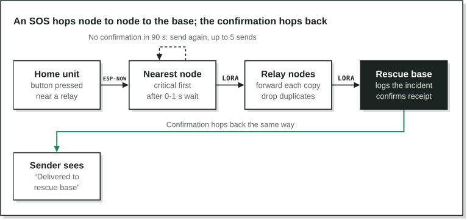
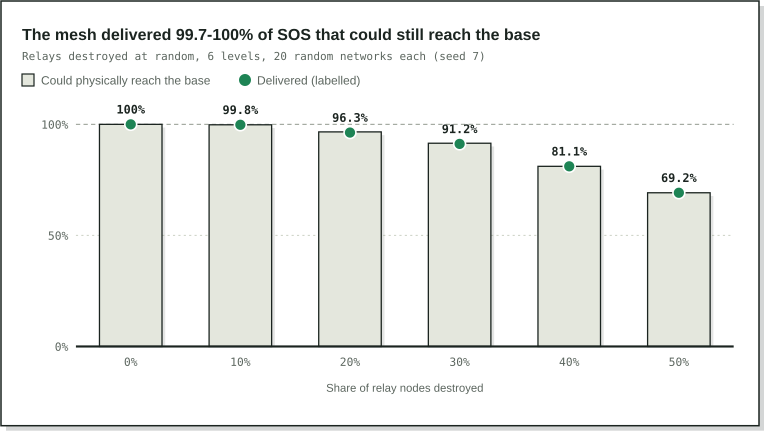

SHISTECH · SDG track · Project brief

# Emergency Mesh: Project Brief

Oct 5, 2026 · Team LVISG

## What it is

Emergency Mesh is a low-cost network of ESP32 + LoRa radio nodes that lets anyone with an ordinary phone send a structured SOS to a rescue base when mobile towers and the internet are down. No app, SIM card or internet is needed.

Disasters knock out phone networks exactly when people need help: after Cyclone Michaung (Chennai, December 2023), about 30% of the city's cell towers were still down (sources in our README). In those first hours, people need to tell someone who can act where they are, what is wrong and how many of them there are.

Built by Manit Bhasin, Divit Rastogi and Rajveer Kapoor (LVISG) for SHISTECH, SDG track: SDG 11.5 (fewer people harmed by disasters) and SDG 9.1 (resilient infrastructure).

## How it works

_path of one SOS · from the protocol in node.py_

Every node rebroadcasts each new message once and drops repeats, so copies travel along every working path and a destroyed relay is simply routed around.

- **Message IDs:** each SOS carries its origin node, a sequence number and an attempt number, so duplicates are dropped while retries still count as one emergency.
- **Hop limit 6:** the farthest node is 4 hops from the base; 2 spare hops allow detours.
- **Priority:** critical, urgent, supplies, then "I'm safe", in that order.
- **Retries:** waits double after each try, so the last of 5 sends is about 23 minutes after the first.
- **Radio:** LoRa at 866 MHz, inside India's licence-free 865–867 MHz band, at SF9 and 125 kHz. An SOS is at most 31 bytes, about 0.25 s on air.

## What we built

The mesh logic is built and tested in software; the physical nodes are designed but not built yet.

| Part                                                                      | Status                                           | Where                                                                                       |
| ------------------------------------------------------------------------- | ------------------------------------------------ | ------------------------------------------------------------------------------------------- |
| Network simulator (Python): forwarding rules, disaster scenarios, results | Built, 16 automated tests                        | `emergency-mesh/simulation`                                                                 |
| Interactive web demo: click a map to send an SOS and watch it hop         | Built, 19 automated tests, live online           | `emergency-mesh/web_demo`                                                                   |
| Node interface: OLED screen, SOS button, status LED                       | Built in the Wokwi ESP32 simulator (MicroPython) | `emergency-mesh/wokwi_node`, [Wokwi project](https://wokwi.com/projects/476841677745845249) |
| Packet format (at most 31 bytes) and LoRa time on air                     | Built                                            | `emergency-mesh/simulation/meshsim/protocol.py`                                             |
| ESP32 firmware with a LoRa radio                                          | Designed, not built                              | README sections 5 and 6                                                                     |
| Phone Wi-Fi SOS page                                                      | Designed, not built                              | README section 7                                                                            |
| Physical nodes and field range tests                                      | Not done yet                                     | README section 10                                                                           |

## Key results

In the Python simulator, which models collisions and packet loss, the protocol delivered almost every SOS that still had a working path to the base.

_Python simulator, README section 3.2 · 0-50% of relays destroyed_

Delivery drops only when nodes are cut off completely, which more nodes fix, not a different protocol.

- **Rerouting:** a critical SOS went 1 → 6 → 7 → 8 → base. With relay 7 destroyed, the next one took 1 → 6 → 11 → 12 → base, with no route to repair.
- **Heavy load:** with 500 SOS in one minute, critical messages arrived in a median of about 2 minutes and "I'm safe" check-ins about 17, but only 79% arrived within an hour. Collisions are the main weakness.
- **Dead nodes:** heartbeats every 15 minutes caught all 30 silently killed nodes, on average 21 minutes later.
- **Our assumptions:** at 500 m range instead of 800 m, nodes 600 m apart cannot hear each other at all, so real spacing must come from measured range.

## Launching the demonstration

Open the live link in any browser, on a laptop or a phone: [manit-bhasin.github.io/Shistech_Lvis/emergency-mesh/web_demo](https://manit-bhasin.github.io/Shistech_Lvis/emergency-mesh/web_demo/). Nothing to install.

**No internet at the venue?** The demo runs fully offline.

1. Before the day, download the repository: on [GitHub](https://github.com/manit-bhasin/Shistech_Lvis), Code → Download ZIP, then unzip it.
2. Double-click `emergency-mesh/web_demo/index.html`. Keep `index.html`, `style.css`, `mesh.js` and `app.js` in the same folder.
3. Optional, as a local website: in the unzipped folder run `py -m http.server 8000` (Windows; `python3` on Mac or Linux), then open `http://localhost:8000/emergency-mesh/web_demo/`.

**Showing the tests** (optional, in a terminal from the repository folder):

- Demo engine: `cd emergency-mesh/web_demo` then `node --test` → 19 tests pass (needs Node 20 or newer).
- Python simulator: `cd emergency-mesh/simulation` then `python -m unittest` → 16 tests pass (`py` on Windows). `python run.py demo` prints the rerouting demo and the rescue dashboard; the charts need matplotlib (`pip install -r requirements.txt`).

> **Before presenting:** open the demo once, set Playback speed to 0.5×, and press Reset.

## Presenting the demo

About five minutes, in this order; step 5 takes the longest, so drop it if time is short. The status line under the buttons narrates each step.

1. **The map.** 25 nodes at gathering points, the rescue base (B) in the centre. Shaded circles are each node's 200 m phone Wi-Fi reach; grey lines are 800 m LoRa links.
2. **Send an SOS.** Click about 50 m from node 1 (bottom left). Red dots hop node to node to the base; the dashboard shows node 1's location, the landmark and the hop count; green dots carry the confirmation back and the person's dot gets a check mark.
3. **Destroy relays.** Choose "Destroy or repair a node", click the relays on that route (they turn into an X), switch back to "Send an SOS" and click near node 1 again. The new route goes around them.
4. **Out of reach.** Click empty space far from any node: "No working node within 200 m". Nodes must sit where people already gather.
5. **Cut off and retry.** Destroy nodes 4, 9 and 10, set speed to 20× and send from node 5. It retries at about 90, 280, 660 and 1390 s, then gives up after 5 tries (about 2 min 20 s at 20×).
6. **A crowd.** Press Reset, then "Simulate a crowd (20 SOS)". Critical messages jump the queue at every node and sit at the top of the dashboard.

> **If asked:** the demo leaves out radio collisions, listen-before-talk and random packet loss so each hop is easy to follow; the Python simulator models all three, and the key results come from it. Everything also works by keyboard (Tab to the map, arrow keys, Enter).

## Limits and next steps

**Limits:** people must reach a node, and phone Wi-Fi reaches only about 200 m, so nodes go where people already gather. A mass event causes heavy radio collisions. Our range and loss figures come from published sources, not our own measurements. The system only helps if a rescue team runs a base station.

**Next steps:**

1. Build 3 physical nodes, measure real range, and re-run the simulator with it.
2. Port the forwarding rules from `node.py` to ESP32 firmware and build the phone SOS page (English and Hindi).
3. Gradient routing (only nodes closer to the base rebroadcast) to cut collisions under heavy load.
4. Authenticate packets between nodes, then run a pilot drill at one school.

**Links:** [live demo](https://manit-bhasin.github.io/Shistech_Lvis/emergency-mesh/web_demo/) · [repository and full README](https://github.com/manit-bhasin/Shistech_Lvis) · [Wokwi node](https://wokwi.com/projects/476841677745845249)
