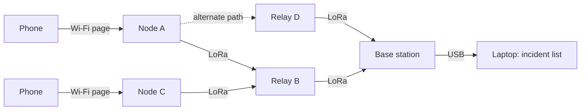

# Emergency Communication Network (ESP32 + LoRa Mesh)

> A low-cost mesh of ESP32 nodes that lets **anyone with an ordinary phone** send a structured SOS to a rescue base when mobile towers and internet are down. No app, no SIM, no internet needed.

**Built by a team from LVISG for SHISTECH (SDG track).**
Team: Manit Bhasin, Divit Rastogi, Rajveer Kapoor.

---

## Project status

| Part | Status | Where |
|---|---|---|
| Mesh logic: message IDs, duplicate dropping, hop limits, priority queue, random delays, listen-before-talk, delivery confirmations, retries, rate limits, heartbeats | **Built and tested** in a Python network simulator (16 automated tests) | [`/simulation`](simulation) |
| Disaster scenarios: rerouting, node failures, mass SOS, dead-node detection, sensitivity to radio assumptions | **Built**, results in Section 3 | [`/simulation/results`](simulation/results) |
| Packet format (max 31 bytes) and LoRa time-on-air | **Built** | [`protocol.py`](simulation/meshsim/protocol.py) |
| Node interface: OLED screen, SOS button, status LED | **Built** in the Wokwi ESP32 simulator (MicroPython) | [`/wokwi_node`](wokwi_node), [live project](https://wokwi.com/projects/476841677745845249) |
| Interactive map demo: click anywhere to send an SOS, destroy or repair nodes, simulate a crowd | **Built**, runs in any web browser | [`/web_demo`](web_demo) |
| Rescue dashboard | **Prototype**: priority-sorted incident table from the simulator (also saved as CSV) | `python run.py demo` |
| ESP32 firmware with LoRa radio | **Designed**, not built | Sections 5–6 |
| Wi-Fi SOS page for phones | **Designed**, not built | Section 7 |
| Physical nodes and field range tests | **Not done yet** | Section 9 |

---

## 1. The problem

Disasters damage mobile networks or cut their power, exactly when people most need to call for help.

- **Cyclone Michaung, Chennai (December 2023).** After the storm, Tamil Nadu's Chief Secretary reported that 70% of Chennai's 42,747 cell towers were operational, so roughly 30% were still down. One resident told Business Standard she had no way to contact rescue teams without a network. ([Outlook India](https://www.outlookindia.com/amp/story/national/michaung-cyclone-live-chennai-india-news-tamil-nadu-cyclone-name-news-334622), [Business Standard](https://www.business-standard.com/india-news/cyclone-michaung-chennai-residents-battle-power-mobile-disruption-123120500994_1.html))
- **Wayanad landslides (July 2024).** Telecom operators had to restore connectivity "on a war footing", and BSNL installed diesel engines so towers could keep working without grid power. ([Deccan Herald](https://www.deccanherald.com/india/keralam/telecom-operators-restore-augment-telecom-connectivity-in-landslide-hit-wayanad-3133367))
- **Satellite SOS is not an option for most Indians yet.** Recent reporting says satellite emergency messaging on iPhones is unavailable in India due to telecom licensing. ([Karmactive](https://www.karmactive.com/apple-satellite-emergency-sos-iphone-14-15-16-india-eligibility/))

**The gap:** in the first hours after a disaster, before towers are restored, ordinary people need a way to send "where I am, what's wrong, how many of us" to someone who can act.

---

## 2. How the system works

1. **Nodes are pre-installed at known gathering points:** schools, relief camps, community halls, water tanks, high ground. Each has a battery and optional solar panel.
2. **A person joins the node's Wi-Fi** (`SOS-HELP-<place>`) and an SOS page opens automatically, with no internet or app needed. Without a phone, they press the node's SOS button.
3. **They choose:** emergency type, number of people, injured/trapped flags, and a short landmark.
4. **The SOS hops node to node over LoRa radio** to a rescue base station.
5. **The base lists incidents by priority** and sends a confirmation back, so the sender sees **"Delivered to rescue base."**
6. **Every node sends regular heartbeats**, so a dead node is noticed before a disaster, not during one.



**Relation to Meshtastic.** [Meshtastic](https://meshtastic.org) is an established open-source LoRa mesh messaging project, and an inspiration for ours. In its typical setup, each user carries their own node paired to a phone app over Bluetooth. ([explainer](https://e2japan.com/radio/guides/meshtastic-explained)) Our design is built specifically for disaster SOS: victims need **no device of their own**, messages are **structured and prioritised**, and the rescue side gets an **incident list** rather than a chat.

---

## 3. Simulation results

The simulator recreates **25 nodes** on a 5 × 5 grid, about 600 m apart (2.4 km × 2.4 km), with the rescue base at the centre. Every node runs the rules planned for the ESP32 firmware. Section 4 explains where every number comes from.

All results below use random seed 7. We repeated the tests with seeds 3 and 11: exact numbers shift (most of all how many nodes stay reachable when many are destroyed, since that depends on which ones go), but the main conclusions held: the network delivered 99.7–100% of reachable messages, critical SOS stayed much faster than "I'm safe" messages under heavy load, and every dead node was detected.

### 3.1 Rerouting around a destroyed relay

A critical SOS travels `1 → 6 → 7 → 8 → base`. Relay 7 is then destroyed, and the next SOS from the same place automatically takes `1 → 6 → 11 → 12 → base`.


Rescue dashboard from the same run (sample Chennai coordinates):

| Priority | Type | Node | People | Flags | Landmark | Hops | Delay |
|---|---|---|---|---|---|---|---|
| CRITICAL | TRAPPED | 1 | 4 | INJURED, TRAPPED | School rooftop | 4 | 2.9 s |
| CRITICAL | MEDICAL | 11 | 7 | INJURED, TRAPPED | Water tank | 2 | 1.5 s |
| URGENT | FIRE | 16 | 1 | CHILD | Water tank | 2 | 0.8 s |
| URGENT | FLOODING | 17 | 8 | CHILD | Water tank | 1 | 1.1 s |
| URGENT | FLOODING | 1 | 6 | ELDERLY, WATER RISING | School rooftop | 4 | 1.9 s |
| SAFE | OTHER | 18 | 5 | – | Water tank | 2 | 6.5 s |

### 3.2 Delivery as nodes fail

Random relays are destroyed, then every surviving node sends one SOS within 30 seconds. 20 random networks per row.

| Relays destroyed | SOS sent | Physically reachable | Delivered | Delivered, of reachable | Sender confirmed | Median delay |
|---|---|---|---|---|---|---|
| 0% | 480 | 100% | 100% | 100% | 100% | 12.5 s |
| 10% | 440 | 99.8% | 99.8% | 100% | 99.3% | 8.7 s |
| 20% | 380 | 96.6% | 96.3% | 99.7% | 95.0% | 6.9 s |
| 30% | 340 | 91.5% | 91.2% | 99.7% | 89.4% | 4.7 s |
| 40% | 280 | 81.1% | 81.1% | 100% | 80.0% | 3.5 s |
| 50% | 240 | 69.2% | 69.2% | 100% | 68.8% | 2.5 s |


"Physically reachable" means a chain of surviving nodes (within 6 hops) still connects the sender to the base. The network delivered **99.7–100% of reachable messages**; almost all losses came from nodes being cut off completely, which only more nodes can fix. The slowest 5% of messages took about 5 minutes, because their early attempts collided in the initial rush and had to be resent.

### 3.3 Many people sending SOS at once

N SOS messages from random nodes within one minute, no nodes destroyed. 5 random networks per row.

| SOS in 1 minute | Delivered within 1 hour | Within 5 minutes | Median delay: critical | urgent | supplies | "I'm safe" |
|---|---|---|---|---|---|---|
| 10 | 100% | 100% | 2.8 s | 2.4 s | 1.9 s | 1.5 s |
| 50 | 100% | 96.8% | 5.5 s | 8.8 s | 91.1 s | 49.4 s |
| 100 | 98.4% | 82.6% | 90.8 s | 92.7 s | 85.8 s | 110.4 s |
| 200 | 86.4% | 62.3% | 97.5 s | 110.5 s | 159.9 s | 209.4 s |
| 500 | 79.0% | 28.6% | 114.4 s | 302.2 s | 618.5 s | 1013.7 s |


- **Under heavy load, priority works:** at 500 messages, critical SOS arrived in a median of about 2 minutes; "I'm safe" check-ins waited about 17.
- **This is the system's main weakness.** Every message travels through every node, so a mass event causes heavy collisions: 40–50 collision events per SOS at 100+ messages. Delivery within an hour falls to 79% at 500 messages. Section 9 lists the planned fix.
- At light load there's no queue, so priority makes little difference.

### 3.4 Detecting dead nodes

Heartbeat every 15 minutes; alert after 30 minutes of silence. 10 runs, 3 nodes killed silently in each.

| Nodes killed | Detected | Missed | False alarms | Average time to alert | Longest |
|---|---|---|---|---|---|
| 30 | 30 | 0 | 0 | 20.8 min | 28.0 min |

### 3.5 What if our radio assumptions are wrong?

We re-ran the failure test (Section 3.2) with other values for radio range and random packet loss. 20 random networks per row.

| Range | Random loss | Destroyed | Reachable | Delivered | Delivered, of reachable |
|---|---|---|---|---|---|
| 500 m | 2% | 0% | 0% | 0% | n/a |
| 650 m | 2% | 0% | 82.7% | 82.3% | 99.5% |
| 650 m | 2% | 30% | 52.1% | 52.1% | 100% |
| **800 m** | **2%** | **0%** | **100%** | **100%** | **100%** |
| **800 m** | **2%** | **30%** | **91.5%** | **91.2%** | **99.7%** |
| 1000 m | 2% | 0% | 100% | 100% | 100% |
| 1000 m | 2% | 30% | 99.7% | 99.7% | 100% |
| 800 m | 0% | 30% | 91.5% | 91.5% | 100% |
| 800 m | 5% | 30% | 91.5% | 91.5% | 100% |
| 800 m | 10% | 30% | 91.5% | 91.2% | 99.7% |

- **Packet loss barely matters** (0–10%), because retries and multiple paths cover lost packets.
- **Range matters a lot.** At 500 m, nodes 600 m apart can't hear each other at all. The protocol still delivered 99.5–100% of reachable messages in every case, but **nodes must be placed closer together than their real range.** In a real deployment, spacing comes from range measured on site.

Full table, including 0% destroyed for every setting: `simulation/results/sensitivity.csv`.

---

## 4. Where the numbers come from

**Radio settings (from published sources):**

| Value | Reason |
|---|---|
| 865–867 MHz band | De-licensed in India, max 1 W transmit power, 4 W ERP, 200 kHz bandwidth ([DoT notification GSR 564(E)](https://dot.gov.in/sites/default/files/Delicensing%20in%20865-867%20MHz%20band%20%5BGSR%20564%20%28E%29%5D_0.pdf)) |
| 866.0 MHz | Middle of that band, so a 125 kHz channel fits inside it |
| SF9, 125 kHz, coding rate 4/5 | SF9 is the suggested starting point for Indian outdoor projects; 125 kHz and 4/5 are the standard settings ([Zbotic SX1276 guide](https://zbotic.in/sx1276-lora-module-range-sensitivity-spreading-factor-guide/)) |
| **800 m range** | The same guide lists **500 m–1 km at SF9 in dense Indian cities** (Delhi, Mumbai, Bangalore) for an SX1276 at +20 dBm with simple antennas. 800 m sits inside that range; Section 3.5 tests 500–1000 m |
| +20 dBm transmit power | The SX1276's maximum (100 mW), which the range figure assumes; well under India's 1 W limit |
| 200 m phone Wi-Fi reach (interactive demo) | Wi-Fi typically reaches about 200 m in open space and 50–100 m indoors ([Makerguides](https://www.makerguides.com/long-range-communication-with-lora-sx1276-and-esp32/)); nodes sit outdoors at gathering points |
| 0.25 s per SOS on air | Calculated with the time-on-air formula in Semtech's SX1276 datasheet, for a 31-byte packet at SF9 |

**Network layout (our design choices):**

| Value | Reason |
|---|---|
| 25 nodes, 2.4 km × 2.4 km | Roughly neighbourhood-sized |
| 600 m spacing, ±100 m random offset | Below the 800 m range, so each node normally reaches its nearest neighbours but rarely its diagonal ones (about 850 m away). This forces multi-hop routes. The offset stops the grid being perfectly regular |
| Base at the centre | Farthest nodes are 4 hops away |
| 2% random loss | Allowance for interference the model doesn't cover; Section 3.5 shows results hardly change from 0% to 10% |

**Protocol settings (our design choices):**

| Value | Reason |
|---|---|
| Hop limit 6 | Farthest node is 4 hops away; 2 spare hops allow detours around destroyed nodes |
| Remember last 256 message IDs | Would use about 1.5 KB on the ESP32. A 16× larger memory didn't change the heavy-load results, so 256 is enough |
| Retry after 90 s, up to 5 sends | Normal delivery takes seconds (median 2.5–12.5 s in Section 3.2), so a retry means the message was truly lost. Waits double each time, so the last retry is about 23 minutes after the first send |
| Wait up to 1 s before sending; 0.2–1.5 s if busy | Spreads transmissions over several packet lengths (one SOS ≈ 0.25 s) to reduce collisions |
| 3 SOS per phone per 10 minutes | Lets someone update their SOS but stops one phone flooding the network |
| Heartbeat 15 min, alert at 30 min | An alert needs two missed heartbeats, so one lost packet doesn't cause a false alarm |

**Test scenarios (our choices):** the 30-second and 1-minute sending windows, the load-test priority mix (30% critical, 30% urgent, 20% supplies, 20% "I'm safe"), and the number of random networks per row (limited by running time). Each is a parameter in [`scenarios.py`](simulation/meshsim/scenarios.py).

---

## 5. Message protocol

| Field | Size | Meaning |
|---|---|---|
| `type` | 1 B | SOS, ACK or HEARTBEAT |
| `origin` | 2 B | Node where the message was created |
| `seq` | 2 B | Counter on that node; `(origin, seq)` identifies the emergency |
| `attempt` | 1 B | 1 for the first send, 2+ for retries |
| `hop_limit` | 1 B | Starts at 6, drops by 1 per hop |
| `hop_count` | 1 B | Hops travelled so far |
| `priority` | 1 B | 3 critical, 2 urgent, 1 supplies, 0 "I'm safe" |
| `emergency_type` | 1 B | Medical, trapped, flooding, fire, collapse, other |
| `people` | 1 B | Number of people |
| `flags` | 1 B | Injured, trapped, child, elderly, water rising |
| `session` | 2 B | Short ID of the phone session, for rate limiting |
| `landmark` | ≤ 16 B | e.g. "Blue gate, Ln 3" (plus 1 length byte) |

An SOS is at most **31 bytes**. ACKs name the `(origin, seq)` they confirm; heartbeats carry battery voltage, uptime and neighbour count.

**Forwarding rules** (implemented in [`node.py`](simulation/meshsim/node.py)):
1. Drop any message ID already seen.
2. Forward only while `hop_limit > 1`.
3. Always send the highest-priority waiting packet first.
4. Wait a random delay before sending; back off if the channel is busy.
5. Copies travel along every surviving path, so there is no route to repair when a node dies.
6. The base confirms every SOS attempt it receives.
7. Without a confirmation, the sender retries with doubling waits, up to 5 sends.
8. Rate limit per phone session; heartbeats from every node.

---

## 6. Hardware design (planned)

| Part | Purpose |
|---|---|
| ESP32 DevKit (ESP32-WROOM-32) | Controller and Wi-Fi SOS page |
| SX1276 LoRa module rated for the 868 MHz band, with antenna | Radio, set to 866.0 MHz. 433 MHz modules (such as the Ra-02) are built for a different band. Never transmit without an antenna |
| 18650 Li-ion cell with a protected charging module | Backup power |
| Small solar panel (optional) | Recharging during outages |
| OLED screen, SOS button, RGB LED | Status and phone-free SOS, as in the Wokwi prototype |
| Weatherproof enclosure | Outdoor installation |

Parts have not been bought; cost per node will be added after purchase.

**Wokwi prototype (built):**

| Component | ESP32 pin |
|---|---|
| OLED SSD1306, SCL / SDA | GPIO 22 / 21 |
| SOS button (internal pull-up) | GPIO 14 |
| RGB LED, red / green / blue | GPIO 27 / 32 / 33 |

Green LED and "ONLINE" while idle. Pressing the button shows "SIGNAL RECEIVED / RELAYING" (blue), then "DANGER" with the node's stored location (red), a sample Chennai coordinate. Relaying here is only a display; the mesh logic is in `/simulation`.

---

## 7. Phone SOS page (designed)

- The ESP32 runs its own Wi-Fi network and redirects every web request to the SOS page, so it opens automatically (the standard `WiFi.softAP()` plus `DNSServer` approach on ESP32).
- **Location:** browsers only share GPS with secure (HTTPS) pages, which a page served by an offline node can't practically be. So each node's location is recorded at installation, and the person adds a landmark.
- English and Hindi; after sending, it shows "Waiting for rescue base…" and then "Delivered."

---

## 8. Limitations

**System:**
- People must reach a node, and phone Wi-Fi range is short, so nodes go where people already gather.
- Unused equipment decays; heartbeats and drills reduce this but don't remove it.
- Mass events cause heavy collisions and long waits for low-priority messages (Section 3.3).
- The SOS page has no login (nobody can create an account mid-disaster), so false alarms are possible; rate limits reduce this.
- It only helps if a control room or rescue team runs a base station.

**Simulation:**
- Range is a simple circle on flat ground: no terrain, buildings or fading beyond random loss.
- Range and loss come from published figures and assumptions (Section 4), not our own measurements.
- Battery use is not modelled.

---

## 9. Next steps

- Build 3 physical nodes, measure real range, and re-run the simulator with the measured value.
- Port the forwarding rules in `node.py` to ESP32 firmware, and build the phone SOS page.
- Gradient routing: only nodes closer to the base rebroadcast, to cut collisions under heavy load.
- Authenticate packets between nodes with a shared key; build a web dashboard; run a pilot drill at one school.

---

## 10. Running the project

**Interactive demo:** open `web_demo/index.html` in any browser; nothing to install. Click near a node to send an SOS and watch it hop to the base, then see it appear on the rescue dashboard with the node's location and landmark. You can also destroy nodes to watch messages reroute, cut a node off completely to watch it retry, or send 20 SOS within 10 seconds to watch critical messages jump the queue.

The demo uses the same layout and forwarding rules as the Python simulator, but leaves out radio collisions, listen-before-talk and random packet loss so each hop is easy to follow. The Python simulator below models all three, and all results in Section 3 come from it.

**Simulator:**


Tested with Python 3.12. Charts need matplotlib; everything else uses the standard library.

```bash
cd simulation
pip install -r requirements.txt     # for charts
python run.py all                   # every scenario; tables, CSVs and charts go to results/
python run.py demo                  # rerouting demo + rescue dashboard
python run.py sensitivity           # Section 3.5
python -m unittest                  # 16 automated tests
```

On Windows, use `py` if `python` isn't recognised. Options: `--range`, `--sf`, `--loss`, `--trials`, `--seed`, `--no-charts`. With the same seed and Python version, results are identical.

```
simulation/
  run.py              command-line runner
  meshsim/
    protocol.py       packet format, encoding, LoRa time-on-air
    node.py           node behaviour (rules planned for the firmware)
    network.py        event-driven radio simulator
    scenarios.py      demo, failures, load, health, sensitivity
    visualize.py      charts
  tests/              automated tests
  results/            CSVs and charts from the last run
web_demo/index.html   interactive map demo (open in a browser)
wokwi_node/main.py    node interface (MicroPython, Wokwi)
```

---

## 11. SDG alignment

- **SDG 11, target 11.5:** reduce deaths and people affected by disasters.
- **SDG 9, target 9.1:** reliable, resilient infrastructure.

This system **complements, not replaces**, cellular, satellite and official emergency systems.

---

## Team

**LVISG, SHISTECH 2026:** Manit Bhasin, Divit Rastogi, Rajveer Kapoor

## License

MIT. See [LICENSE](LICENSE).
